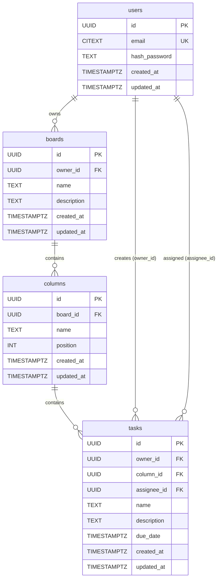

<div align="center">

# 🚀 Sprintly API

**Production-ready task management REST API built with Go**

REST API for managing boards, columns, and tasks with JWT authentication,
rate limiting, pagination, and full CI/CD deployment to a Hetzner VPS.

[](https://github.com/mykytakuzminov/sprintly-api/actions/workflows/ci.yml)
[](https://github.com/mykytakuzminov/sprintly-api/actions/workflows/cd.yml)
[](https://go.dev/)
[](./LICENSE)

[API Docs (Swagger UI)](http://204.168.173.88:8080/swagger/index.html) · [Health Check](http://204.168.173.88:8080/api/v1/health)

</div>

---

## Features

- **JWT Authentication** — access + refresh token pair with Redis-backed invalidation on logout
- **Rate Limiting** — token bucket algorithm per user (authenticated) or IP (anonymous)
- **Pagination, Sorting & Filtering** — all list endpoints support `limit`, `offset`, `sort`, `order`
- **Clean Architecture** — domain / service / repository / handler layers with interface-driven design
- **Integration Tests** — real PostgreSQL and Redis via Testcontainers, isolated in transactional fixtures
- **Unit Tests** — handler and service layers fully covered with mocks
- **Database Migrations** — versioned SQL migrations embedded in the binary via `go:embed`
- **Structured Logging** — `zap` with trace IDs propagated per request
- **Graceful Shutdown** — OS signal handling with 5s drain timeout
- **Health Check** — `/api/v1/health` reports DB and Redis liveness

---

## Tech Stack

| Layer | Technology |
|---|---|
| Language | Go 1.26 |
| Router | chi v5 |
| Database | PostgreSQL 18 (pgx/v5) |
| Cache / Sessions | Redis 8 (go-redis/v9) |
| Auth | JWT (golang-jwt/v5) + bcrypt |
| Migrations | golang-migrate/v4 (embedded) |
| Validation | go-playground/validator/v10 |
| Logging | uber/zap |
| Docs | swaggo/swag + http-swagger |
| Testing | stdlib `testing` + testcontainers-go |
| Containerization | Docker (multi-stage) + Docker Compose |
| CI/CD | GitHub Actions → GHCR → Hetzner VPS |

---

## Architecture

Dependencies always point inward — handlers depend on services, services depend on repositories, repositories implement domain interfaces.

```
┌──────────────────────────────────────────────────────┐
│                    HTTP (chi router)                 │
│  AuthMiddleware · TraceMiddleware · RateLimiter      │
└────────────────────────┬─────────────────────────────┘
                         │
┌────────────────────────▼─────────────────────────────┐
│                      Handlers                        │
│   UserHandler · AuthHandler · BoardHandler           │
│   ColumnHandler · TaskHandler · HealthHandler        │
└────────────────────────┬─────────────────────────────┘
                         │  domain interfaces
┌────────────────────────▼─────────────────────────────┐
│                      Services                        │
│   UserSvc · AuthSvc · BoardSvc · ColumnSvc           │
│   TaskSvc · RateLimitSvc · HealthSvc                 │
└────────────────────────┬─────────────────────────────┘
                         │  domain interfaces
┌────────────────────────▼─────────────────────────────┐
│                    Repositories                      │
│   pgrepo (PostgreSQL)    rdrepo (Redis)              │
│   UserRepo · BoardRepo   TokenRepo · RateLimitRepo   │
│   ColumnRepo · TaskRepo                              │
└──────────────────────────────────────────────────────┘
```

---

## Database Schema



---

## Getting Started

**Prerequisites:** Docker, Docker Compose

```bash
git clone https://github.com/mykytakuzminov/sprintly-api.git
cd sprintly-api

cp .env.example .env

docker compose up -d
```

API: `http://localhost:8080/api/v1`
Swagger: `http://localhost:8080/swagger/index.html`

```bash
# Run tests (spins up Testcontainers automatically)
make test
```

---

## CI/CD

```
Pull Request → main
  ├── tidy · format · lint · build · test

Merge to main
  ├── Build Docker image (multi-stage)
  ├── Push to GHCR (:latest + :<sha>)
  └── Deploy to Hetzner via SSH
```

---

## Environment Variables

| Variable | Description | Default |
|---|---|---|
| `SERVER_PORT` | Server port | `8080` |
| `POSTGRES_HOST` | PostgreSQL host | `localhost` |
| `POSTGRES_PASSWORD` | PostgreSQL password | required |
| `POSTGRES_DB` | Database name | required |
| `JWT_SECRET` | JWT signing secret | required |
| `JWT_ACCESS_TTL` | Access token TTL | `15m` |
| `JWT_REFRESH_TTL` | Refresh token TTL | `168h` |
| `REDIS_HOST` | Redis host | `localhost` |
| `REDIS_PASSWORD` | Redis password | required |

See [`.env.example`](./.env.example) for the full list.

---

## License

[MIT](./LICENSE)
